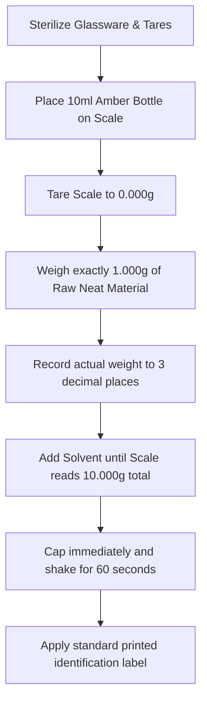

# 🗃️ Student Organ Setup & Dilution Guide
## Perfumery Course Reference Manual

This guide outlines the specifications, sourcing requirements, physical geography, and dilution mathematics required to build and organize a professional-grade **60-Material Student Perfumery Organ**.

---

## 📐 1. Organ Geography & Layout Design

The physical arrangement of a perfumery organ is designed to optimize olfactory workflow, prevent cross-contamination, and reinforce cognitive associations between raw materials, their volatility, and their scent families.

We adopt the **Jean Carles Concentric Tier System**, structured horizontally by **Olfactory Families** and vertically by **Volatility (Volatility Tiers)**.

### 🗼 The Three-Tier Vertical Structure
Your organ shelves or racks should be arranged into three distinct vertical steps or tiers:

```text
               [ TIER 3: BASE NOTES (Resins, Woods, Musks) ]
         [ TIER 2: HEART NOTES (Florals, Spices, Greens) ]
   [ TIER 1: TOP NOTES (Citrus, Light Esters, Fruity notes) ]
======================== [ WORKSPACE / SCALE ] ========================
```

* **Tier 1 (Front/Bottom): Top Notes.** High volatility, short evaporation curves. These are the first materials smelled and the easiest to reach.
* **Tier 2 (Middle): Heart Notes.** Medium volatility. The modifiers, florals, and spices that bridge the fragrance together.
* **Tier 3 (Back/Top): Base Notes.** Low volatility, high tenacity. Heavy molecules, fixatives, woods, and resins.

### 🌈 Horizontal Olfactory Lane Segmentation
Within each vertical tier, bottles are grouped left-to-right based on their olfactory descriptors to allow easy comparison:

1. **Top Notes (Tier 1):** `[ Citrus ] ➔ [ Light Esters / Fruity ] ➔ [ Green / Herbal ]`
2. **Heart Notes (Tier 2):** `[ Light Floral ] ➔ [ Heavy Floral ] ➔ [ Spicy ] ➔ [ Soft Woody ]`
3. **Base Notes (Tier 3):** `[ Deep Woody ] ➔ [ Resinous / Balsamic ] ➔ [ Ambers ] ➔ [ Musks ]`

---

## 🛒 2. Equipment Sourcing Specifications

To perform precise and reproducible blending, students must source professional-grade laboratory and blending equipment.

| Equipment | Minimum Specification | Purpose |
| :--- | :--- | :--- |
| **Precision Scale** | Max weight: 200g–500g, Resolution: **0.001g (1 milligram)** | Crucial for weighing heavy base synthetics and trace elements accurately. Do not use 0.01g scales. |
| **Amber Glass Bottles** | 10ml size, with glass pipettes or high-density dropper caps | Storage of 10% dilutions. Amber glass prevents UV degradation. |
| **Stock Bottles** | 15ml or 30ml amber glass with airtight polycone caps | Safe long-term storage of neat (100%) materials. |
| **Smelling Strips** | Standard 150mm length, glue-free, absorbent cotton-paper | Evaluating materials without skin contact or solvent interference. |
| **Transfer Pipettes** | 1ml and 3ml capacity disposable LDPE pipettes | Drawing and transferring solvents and materials safely. |
| **Solvents** | 190-Proof Perfumer's Alcohol (pure SDA-40B Ethanol) & DPG | Solvents for dilution (Ethanol for fine fragrance, DPG for low-volatility bases). |

---

## 🧪 3. Dilution Mathematics & Lab Protocols

Most raw perfumery materials are solid crystals, thick resins, or highly potent aroma chemicals that cannot be worked with in their pure (neat) state. Students must dilute these to a standard **10% w/w (weight-to-weight)** solution before physical organ assembly.

### 📐 Weight-to-Weight (w/w) vs. Volume (v/v)
In professional perfumery, all formulations are made by **weight**, not volume. Density variations make dropper count or milliliter measurements highly inaccurate.

To calculate a **10% w/w dilution**:
$$\text{Mass of Raw Material} + \text{Mass of Solvent} = \text{Total Solution Weight}$$
$$\text{Mass of Raw Material} = 0.10 \times \text{Total Solution Weight}$$

#### 📝 Formula Reference: Creating 10.00g of a 10% Dilution
$$\text{Weight of neat material} = 1.000\text{g}$$
$$\text{Weight of Solvent} = 9.000\text{g}$$

#### 📝 Formula Reference: Creating 10.00g of a 1% Dilution (for trace materials like Aldehydes)
$$\text{Weight of neat material} = 0.100\text{g}$$
$$\text{Weight of Solvent} = 9.900\text{g}$$

---

## 🥽 4. Safe Dilution Laboratory Protocol

Before building your organ, execute this workflow in a clean, well-ventilated workspace:



### 🏷️ Standardized Bottle Labeling Format
To maintain inventory hygiene, every bottle on the student organ must have a clean, printed label following this exact structure:

```text
========================================
[VOLATILITY]   [OLFACTORY GROUP]
Material Common Name (dilution strength)
CAS: XXX-XX-X | Batch Date: YYYY-MM-DD
Solvent Used: [Ethanol / DPG]
========================================

Example:
----------------------------------------
BASE NOTE      WOODY
Iso E Super (10%)
CAS: 54464-57-2 | Date: 2026-05-28
Solvent: SDA-40B Ethanol
----------------------------------------
```

---

## ⚠️ 5. Safety & Preservation Rules

1. **UV Radiation Protection:** Store the organ away from direct sunlight. Sunlight rapidly breaks down sensitive natural monoterpenes (like citrus oils) and turns clear synthetics yellow or brown.
2. **Temperature Hygiene:** Keep the organ in a cool room (18°C–22°C). High heat accelerates evaporation of top notes through bottle seals.
3. **Cross-Contamination Prevention:** Never dip a pipette used in one bottle into another bottle. Use a fresh pipette for every transfer.
4. **Ventilation:** Always dilute neat materials under an exhaust hood or in an open area with cross-ventilation to prevent respiratory sensitization.
